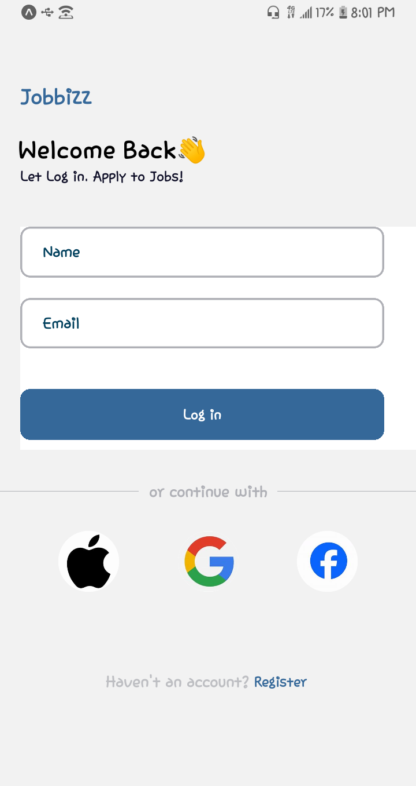

# rn-assignment4-ID-11116471
DCIT202 MOBILE APPLICATION DEVELOPMENT

## The following components are briefly described, providing an overview of each component's usage."

## Usage

The project includes the following components:

### StyleSheet

The `StyleSheet` defines and manages styles for React Native components, providing a structured way to write and organize styles.

### SafeAreaView

The `SafeAreaView` renders content within a safe area of the screen, ensuring that the content is visible and not obscured by notches, rounded corners, or other device-specific features.
### TouchableOpacity

The `TouchableOpacity` provides a button-like behavior to the wrapped content, offering touch feedback and allowing you to handle various touch events.

### ScrollView

The `ScrollView` Provides a scrollable container for displaying a large amount of content that doesn't fit on the screen, allowing users to scroll and view the content within a confined area.

### TextInput

The `TextInput` Provides an input field for users to enter text, such as usernames, passwords, or search queries.

### Text

The `Text` componentDisplays text content within the application, supporting various styling options for customizing the appearance of the text.
### Image

The `Image` displays images within the application, loading from local resources or remote URLs. It also provides options for resizing and styling the images.

### View

The `View` component serves as a container for grouping and arranging other components, commonly used to structure the layout of the application and apply styles.

### ImageBackground

The `ImageBackground` component Displays an image as the background of a container, allowing you to set an image as the background and overlay other components on top of it.

## These are the SCREENSHOTS of my project
 

  